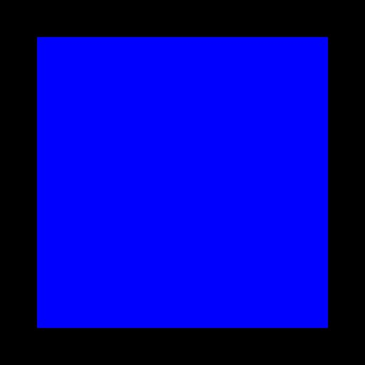

==================
Diffusion Equation
==================

This example solves the weak form of the following diffusion equation,

|diffusion_equation|

using the Galerkin Finite Element method. |conductivity_tensor| and |alpha| are the positive definite and symmetric rank two conductivity tensor and a scalar parameter (e.g. thermal capacity) respectively. The dependent variable |u| is a spatially varying scalar field (e.g. temperature). In this example an isotropic and homogeneous material with |equation1| (identity tensor) and |equation2| is considered. 

   :align: middle

   :align: middle
   
.. |alpha| image:: ./docs/images/alpha.svg
   :align: middle

.. |u| image:: ./docs/images/u.svg 
   :align: middle
   

.. |equation2| image:: ./docs/images/equation2.svg
   :align: middle

   :align: middle
   
Building the example
====================

The fortran version of the example can be configured and built with CMake::

  git clone https://github.com/OpenCMISS-Examples/diffusion_equation
  mkdir diffusion_equation-build
  cd diffusion_equation-build
  cmake -DOpenCMISSLibs_DIR=/path/to/opencmisslib/install ../diffusion_equation
  make

This will create the example executable "diffusion_equation" in ./src/fortran/ directory.

Running the example
===================

Fortran version::

  cd ./src/fortran/
  ./diffusion_equation

Verifying the example
=====================

Results can be visualised by running `visualise.cmgui <./src/fortran/visualise.cmgui>`_ with the `Cmgui visualiser <http://physiomeproject.org/software/opencmiss/cmgui/download>`_.

The following figure shows the finite element mesh (computational domain) and scalar field, |u| (primary variable: e.g. temperature) and its derivative, |du_dn| (secondary variable: e.g. heat flux).

   :width: 250
   :scale: 100

   :width: 250
   :scale: 100

   :width: 250
   :scale: 100   
    
|figure1a|  |figure1b|  |figure1c|

Figure 1. (a) Finite element mesh (b) Primary variable solution (c) Secondary variable solution

The expected results from this example are available in `expected_results <./src/fortran/expected_results>`_ folder.

Prerequisites
=============
There are no additional input files required for this example as it is self-contained.

License
=======
License applicable to this example is described in `LICENSE <./LICENSE>`_.
